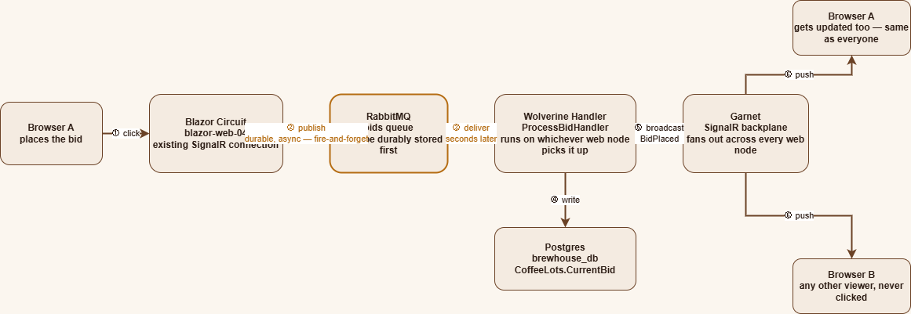
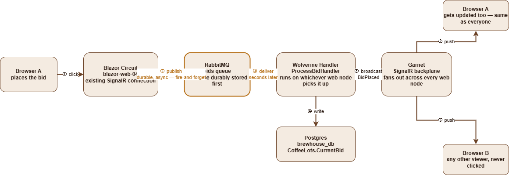

# 12. How BrewHouse's Requests Actually Flow

Two real interactions, two different shapes. Placing a bid is queued and handled
asynchronously, broadcast back to every open browser. Uploading a photo is a plain,
synchronous round trip through the same storage abstraction, start to finish.

Source diagram: `request-flows.drawio` (two tabs — "Bid Flow" and "Photo Upload Flow";
open in [draw.io](https://app.diagrams.net/) or the VS Code draw.io extension). Exported
as `request-flows-bid.png` and `request-flows-photo-upload.png` — export both tabs at 2x
and drop them in `docs/` alongside this file if the images below aren't showing yet.

## Placing a bid — asynchronous, queued

1. **Browser A clicks "Bid $X"** over its already-open SignalR connection to a Blazor
   circuit on one of the web nodes (e.g. `blazor-web-04`).
2. **The circuit publishes `ProcessBidMessage`** via Wolverine (`IMessageBus.PublishAsync`)
   to the `bids` queue on RabbitMQ. This is durable and asynchronous — the envelope is
   stored before the publish call returns, and nothing waits on a reply. Fire-and-forget
   from the browser's perspective (ADR 79).
3. **RabbitMQ delivers the envelope** to whichever web node's Wolverine listener picks it
   up next — seconds later, not synchronously with step 2. It does not have to be the
   same node that published it.
4. **`ProcessBidHandler` writes the new bid** to Postgres (`brewhouse_db`,
   `CoffeeLots.CurrentBid`) via EF Core.
5. **The handler broadcasts `BidPlaced`** through Garnet, the shared SignalR backplane
   (ADR 04/08) — this is what actually fans a single bid out to every connected browser
   regardless of which web node they're attached to.
6. **Garnet pushes the update to every open circuit**, including Browser A's own — the
   browser that clicked gets its UI updated the exact same way every other viewer does,
   not through a direct response to its click.

The click (step 1-2) and the write (step 3-4) are two different requests, not one. Step 2
hands the bid to RabbitMQ and returns immediately; step 6 is what actually updates every
screen. This decoupling is also why bids showed up as isolated single-span traces in
Grafana/Tempo until `docs/01` ADR 105 registered Wolverine's own `ActivitySource` — without
it, the publish (step 2) and the handling (step 3-4) had no visible link between them at
all, let alone a nested one.

**Confirmed live** (`docs/01` ADR 105): after registering `.AddSource("Wolverine")`, a real
bid's `send` span and its `ProcessBidMessage` handler span landed **1.6 seconds apart** in
the same trace — direct proof this hop is genuinely asynchronous, not simulated for this
diagram.

## Uploading a photo — synchronous, direct

1. **Browser clicks "Simulate Photo Upload"** over the same open SignalR connection.
2. **The circuit's `UploadMockPhoto()` handler reads the bundled sample photo** from
   `wwwroot/images/sample-lot-photo.png` and writes it through `IBlobStore.WriteBytesAsync`
   — awaited, synchronous, no queue involved. The same interface works against local disk
   (the NAS mount in the homelab) or S3 (via the Floci emulator in a PR preview) with no
   branching in application code (ADR 03).
3. **Once the write returns, the same circuit re-renders** and pushes a new `` tag
   (pointing at `/api/photos/{path}`) to the browser over the same SignalR connection.
4. **The browser then issues its own ordinary HTTP `GET`** for that image URL — a plain
   request, not routed through SignalR at all.
5. **The `/api/photos/{**path}` endpoint reads the bytes back** via
   `IBlobStore.ReadBytesAsync` — the *exact same* storage backend the click just wrote to.
6. **The endpoint returns the image bytes**, and the browser renders the real photo.

No queue, no async handoff — the click, the write, and the read-back all happen on the
same request path. Step 2 and step 5 hitting the exact same storage backend is the whole
point of this feature (ADR 94): a genuine write-then-read round trip through the real
configured backend, not a static asset unlocked by the click.
